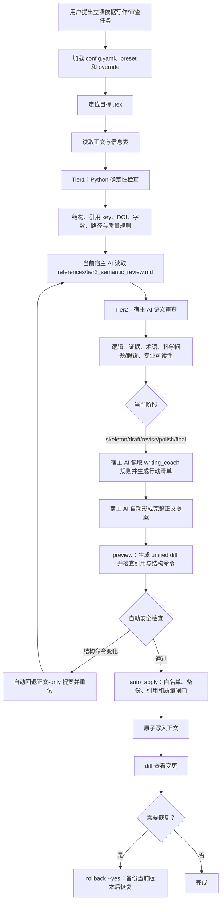

# `nsfc-justification-writer` 如何一步步处理立项依据

## 总体流程



图中需要特别区分两层：Tier1 是脚本执行的确定性检查；Tier2 不由 Python 调用模型，而是由当前宿主 AI 按参考 Markdown 直接完成。

> 本文按当前 `skills/nsfc-justification-writer/scripts/` 下的 Python 源码、`config.yaml` 以及 Tier2 参考规范整理；没有把历史计划当作流程依据。文中“写出正文”必须特别理解为：Python 负责准备、检查和安全写入，真正的自然语言成稿与 Tier2 语义审查由当前宿主 AI 或用户完成。

关键源码入口：[`run.py`](../../skills/nsfc-justification-writer/scripts/run.py)、[`hybrid_coordinator.py`](../../skills/nsfc-justification-writer/scripts/core/hybrid_coordinator.py)、[`writing_coach.py`](../../skills/nsfc-justification-writer/scripts/core/writing_coach.py)、[`diagnostic.py`](../../skills/nsfc-justification-writer/scripts/core/diagnostic.py)、[`security.py`](../../skills/nsfc-justification-writer/scripts/core/security.py)、[`editor.py`](../../skills/nsfc-justification-writer/scripts/core/editor.py)、[`ai_integration.py`](../../skills/nsfc-justification-writer/scripts/core/ai_integration.py)。其中 `AIIntegration` 仅服务 coach/review 等仍保留的宿主 AI 辅助功能，不负责 Tier2。

## 一句话结论

这个 Skill 不是一个“输入课题、自动返回完整标书”的单体生成器，而是一条混合流水线：

```text
加载配置
  → 找到立项依据 tex
  → 读取正文/信息表
  → Tier1 确定性检查
  → Tier2 宿主 AI 语义检查（必选；当前宿主 AI 直接读取 `references/tier2_semantic_review.md` 执行）
  → 判断 skeleton/draft/revise/polish/final 阶段
  → 组装写作教练 prompt
  → 宿主 AI 直接执行 Tier2/coach；没有宿主 AI 响应时，Python 仅能输出确定性检查和固定的 Markdown 行动清单
  → 宿主 AI 自动形成正文提案
  → preview 生成 diff、检查引用和结构命令
  → 自动检查通过后按白名单备份并写入（`--dry-run` 可只读）
  → 备份、diff、rollback
```

因此，“立项依据是怎样被写出来的”实际分成两部分：

1. `coach` 通过检查结果和写作 prompt 引导 AI/用户形成论证链。
2. `preview` 自动检查、备份并保存已经形成的正文；`apply-section` 仅为旧项目保留。它们不会凭空创作无法核验的科学事实。

## 1. 入口与配置加载

CLI 入口是 `scripts/run.py`。每个子命令先根据 skill 根目录创建 `HybridCoordinator`，然后由 `load_config()` 合并配置：

1. 先放入源码中的安全兜底 `DEFAULT_CONFIG`，至少包含写入白名单 `extraTex/1.1.立项依据.tex`、禁止写入 `main.tex`/`extraTex/@config.tex` 和 `**/*.cls`/`**/*.sty`。
2. 合并仓库 `config.yaml`。
3. 如果传入 `--preset`，优先合并 `assets/presets/<name>.yaml`，再兼容旧的 `config/presets/<name>.yaml`。
4. 默认读取用户目录下 `~/.config/nsfc-justification-writer/override.yaml|yml`；可以用环境变量关闭，或用 `--no-user-override` 关闭。
5. 最后合并 `--override` 指定的 YAML，优先级最高。
6. 有 PyYAML 时校验关键字段；即使关闭校验，也会再次加固写入白名单，防止空策略放开任意写入。没有 PyYAML 时跳过强校验，但仍保留安全兜底。

默认运行目录是 skill 下的 `tests/_artifacts/runs`；`NSFC_JUSTIFICATION_WRITER_RUNS_DIR` 可以覆盖它。AI 缓存默认在 `tests/_artifacts/cache/ai`，仅供 coach/review 等仍由 Python 协调的宿主 AI 辅助调用使用，Tier2 不使用该缓存。

运行时 `style.mode` 只有 `theoretical`、`mixed`、`engineering` 三种。它只改变写作提示的证据重心，不决定结构是否通过。仓库当前默认是 `theoretical`，默认目标字数为 9000、容差 800、统计模式 `cjk_only`。

## 2. 找到真正要处理的 `.tex`

`HybridCoordinator._target_relpath()` 的规则非常明确：

- `targets.justification_tex` 非空时，直接把它当作项目根目录下的相对路径。
- 为空时，只读扫描项目根目录的 `main.tex`，提取其中的 `\\input{...}` 和 `\\include{...}`；没有 `.tex` 后缀就自动补上。
- 过滤越出项目根目录、`main.tex` 本身和不存在的文件。
- 只有恰好一个候选时才采用；零个或多个候选都抛出 `TargetResolutionError`，不会猜测。

随后 `validate_target_file()` 将路径解析为绝对路径，拒绝越出 `project_root` 的路径；诊断允许目标暂不存在，写入路径还要通过更严格的白名单/禁写规则。

## 3. 输入信息从哪里来

### 3.1 正文

正文用 `read_text_streaming()` 读取，默认 UTF-8、错误忽略。当前 Python 诊断会读取完整正文；Tier2 的正文范围、是否分段以及上下文组织由宿主 AI 按任务需要处理，Python 不为 Tier2 分块。

### 3.2 信息表

`init` 有两条路径：

- 非交互模式：复制 `references/info_form.md` 到 runs 目录或 `--out` 指定路径。
- `--interactive`：逐项询问并写出信息表。必填项是研究对象/场景、痛点与不足、关键科学问题、核心科学假设、项目切入点；选填项是方法概览、前期基础、代表工作、其它补充。

信息表的五个核心字段会明确要求：痛点给出 2–4 条瓶颈及“瓶颈→问题约束”映射；科学问题写疑问句；假设写可证伪陈述句且不写验证方式；切入点写差异化破局并承接研究内容。

`diagnose` 和 `wordcount` 不读取用户 CLI 意图，只按顺序寻找 `<project_root>/info_form.md`、`<project_root>/references/info_form.md` 的第一个可读文件。`coach` 的信息表则由 `--info-form` 显式传入。

## 4. Tier1：先做不依赖 AI 的确定性检查

`run_tier1()` 对当前 tex 同时做以下检查，结果装入 `Tier1Report`。

### 4.1 结构检查

使用 `parse_subsubsections()` 解析 `\\subsubsection` 和 `\\subsubsection*`，支持可选短标题、嵌套花括号和注释剥离。

结构规则来自配置：预期标题列表、是否严格匹配、最少小节数。没有这些配置时，结构检查实际上不构成失败门槛，只报告检测到多少个小节。源码注释明确表示不把标题/宏当作普遍规范。

### 4.2 引用 key、DOI 格式

`parse_cite_keys()` 先去掉注释和 `verbatim`、`lstlisting`、`minted` 环境，再识别带可选参数的 `\\cite...{a,b}`。随后按 `targets.bib_globs`（默认 `references/*.bib` 与 `references/**/*.bib`）扫描 `.bib`：

- 找不到的 bibkey 进入 `missing_citation_keys`。
- 已存在但没有 DOI 字段的 key 进入 `missing_doi_keys`。
- DOI 去掉 `https://doi.org/` 等前缀后，若不匹配 `10.数字/非空字符串`，进入 `invalid_doi_keys`。

DOI 缺失/格式可疑是提示，不是 Tier1 写入阻断；缺失 bibkey 才是默认写入阻断。

### 4.3 字数

默认 `cjk_only`：只移除注释，再统计 CJK 字符；命令参数和数学环境中的中文也可能被计入。另有 `cjk_strip_commands`：额外粗略去掉类代码环境、数学环境、控制序列和转义字符。它是字符数估计，不是排版后的 Word 字数。

目标字数解析优先级是：用户意图文本（当前 `diagnose/wordcount` 没有传入，因此为空）→信息表中的“2500-3000 字”“3000±200 字”等模式→配置 `word_count`→预设标记。目标会被 `limits.word_target` 的 100–20000 范围截断。

### 4.4 危险命令与第三方约束

`quality.avoid_commands` 是配置提供的确定性命令列表；去注释后只做字符串命中。当前默认列表为空，所以默认不会因为现有正文命令而报警。

如果配置了 `constraints`，还会生成只读预警 snapshot：按“正文字符数/每页字符数”粗估页数，统计去重引用数，比较字数/文献数区间；只有显式配置 `constraints.opening.cjk_chars` 时，才检查开头 N 个中文字符是否同时出现“局限/瓶颈”等信号和“本项目/切入/突破”等信号。它们不阻断写入。

## 5. `coach` 是实际的渐进式写作引擎

CLI 调用 `HybridCoordinator.coach()`，最终进入 `coach_markdown()`。其步骤如下。

### 5.1 建立 Coach 输入包

它读取目标 tex，运行一次 Tier1，把结果转换成普通字典；解析目标字数；读取风格模式和风格前缀。术语、论证维度和专业可读性不再由 Python 侧的矩阵或固定清单预检查，而是交给宿主 AI 根据当前课题和正文自主规划。

### 5.2 自动判断当前阶段

`stage=auto` 先使用硬编码 fallback 规则：

1. tex 为空，或结构检查已启用但不通过 → `skeleton`。
2. 字数小于 `max(target×0.4, 600)` → `draft`。
3. 引用不通过，或命中危险命令 → `revise`。
4. 字数偏离目标容差 → `polish`。
5. 否则 → `final`。

如果 `writing_coach.enable_ai_stage_inference=true` 且 AI 可用，会把最多 `writing_coach_preview_chars`（默认 3000）字符、Tier1 状态、目标字数和阶段定义交给 AI，让 AI 返回 JSON 的 `stage`；返回五个合法阶段之一时覆盖 fallback 判断，否则使用 fallback。配置 `ai_inference_mode=ai_only` 且 AI 不可用时，阶段会返回 `auto`。

### 5.3 组装写作提示词

`assets/prompts/writing_coach.txt` 被 `get_prompt()` 读取，配置中的 prompt 路径或内联文本可以覆盖它。填充字段包括：阶段、风格前缀、信息表、Tier1 JSON 和最多 12000 字符的当前 tex。prompt 明确要求宿主 AI 自主决定需要检查的术语、论证维度和可读性风险。

提示词要求输出 Markdown，包含：阶段判断依据；本轮只做三件事；不超过 8 个需要补充/确认的问题；下一步可复制的写作提示词。它明确要求：

- 论证链围绕领域价值、已有证据、认知缺口、科学问题、可证伪假设、研究内容。
- 科学问题追问未知关系/机制/性质/边界，必须是疑问句，不能写成“开发/构建/实现”。
- 假设必须是针对未知的可证伪预测性陈述，不能把验证方式写进句子。
- 假设之前主要放领域事实、已有研究和缺口；项目干预、比较、终点、技术路线放在假设之后。
- 不新增无法核验的引用、DOI、结果或绝对化表述；需要外部证据时要求用户提供 DOI/链接或可核验题录信息。
- `polish` 先保护事实、论证、术语、限定、引用和 LaTeX 结构，再处理长句、指代、缩写界定、抽象名词关系和段内衔接；不能为了通俗删除专业信息。

### 5.5 Coach 的 AI 调用和降级

对于 coach 的阶段推断和写作教练，Python 不直接连接某个大模型。`AIIntegration` 只接受宿主传入的 `responder(task, prompt, output_format)`：

- 可同步或异步返回字符串、字典或空值。
- JSON 输出接受字典，或从 fenced JSON/第一个平衡花括号中解析。
- 文本输出直接转字符串。
- 有缓存时按 `task + output_format + prompt` 的 SHA-256 命名；未指定 `fresh` 时命中缓存直接返回。
- AI 未启用、没有 responder、返回为空、格式解析失败或调用抛错，都会执行 fallback，并把 `fallback_mode` 置为 true。这个实例后续的 `is_available()` 也会变成 false，因此后续请求继续回退。

`coach` 的 fallback 不是正文，而是阶段化 Markdown 清单：

- skeleton：确认正文边界，先写事实/证据/缺口，建立“科学问题→假设”和“瓶颈→约束”映射。
- draft：先写自动确定的最小安全正文范围 1–2 段，把瓶颈收束成科学问题约束，再扩写到目标长度。
- revise：先修复缺失 key；把不可核验表述改成对照维度/指标；检查问题疑问句和假设预测句，其它语义风险由宿主 AI 自主识别。
- polish：先列出不可改变的科学含义，再处理长句、指代、缩写、抽象名词、过渡和结尾衔接。
- final：由宿主 AI 按 `references/tier2_semantic_review.md` 完成 Tier2，确认只修改授权正文范围。

这意味着没有 responder 时，coach 仍能告诉用户“下一步怎么写”，但不会替用户生成真实段落；这不影响当前宿主 AI 直接执行 Tier2 的主流程。

## 6. 诊断、评审和示例辅助（Tier2 必选）

### 6.1 `diagnose`

先做 Tier1；随后由当前宿主 AI 读取 `references/tier2_semantic_review.md` 并直接执行 Tier2。Python 不调用 responder、不生成 fallback 语义结论；结构问题与语义问题并列报告。

Tier2 的检查范围、保真约束和 Markdown 输出格式统一见 `references/tier2_semantic_review.md`，由宿主 AI 直接读取并执行。该步骤不再由 `HybridCoordinator` 分块、缓存或调用 `AIIntegration.responder`；`diagnose` 只提供 Tier1 报告与待审查上下文。

### 6.2 `review`

先完整运行 `diagnose`，再把 Tier1 JSON、最多 12000 字符 tex、实际 DoD 清单内容和风格前缀交给 `review_suggestions.txt`。该 review 辅助仍可通过宿主 responder 返回 Markdown，失败时使用固定评审清单；它不写文件、不替正文。Tier2 语义审查仍按 `references/tier2_semantic_review.md` 由当前宿主 AI 直接执行，不由这段 Python review 调用承担。

### 6.3 `examples`

`recommend_examples()` 调用 `example_matcher` 对 `assets/examples` 做主题匹配；AI 可用时请求推荐，失败时使用源码中的 token/关键词相似度回退。它只推荐参考骨架，不把示例自动合并进正文。

## 7. `preview`：把已经写好的完整提案变成可审查 diff

`preview` 要求 `--proposal-file`，其中 `-` 表示 stdin。它先解析目标文件（可由 `--target-file` 显式指定），然后用 `inspect_proposal()` 比较原文和完整提案：

1. 统计变更行数。
2. 生成 unified diff。
3. 对新增/删除行扫描 `\\part`、`\\chapter`、`\\section`、`\\subsection`、`\\subsubsection`、`\\paragraph`、`\\input`、`\\include`、`\\begin`、`\\end`、`\\label`、`\\newcommand`、`\\renewcommand`、`\\documentclass`、`\\usepackage`。
4. 检查提案内所有引用 key；缺失 key 记录为待核验项，自动流程不暂停。
5. 命中结构/配置命令时默认返回非零并要求保留这些命令，除非显式加 `--allow-structural-change`。即使放开，它仍然只是只读预览，不会写入。

`preview` 是推荐的新流程：自动生成完整正文提案和 diff，通过安全检查后自动落盘；需要只读时加 `--dry-run`。

## 8. `apply-section`：旧式、按标题替换的真正写入路径

这是 legacy 兼容入口，不是 `coach` 自动调用的下一步；CLI 会先警告它依赖标题解析并会写入文件。

写入顺序：

1. 读取 `--body-file` 或 stdin；空正文立即返回错误。
2. 解析目标文件并通过写入白名单：目标必须在项目根目录内；不能是禁止文件；不能匹配 `.cls`/`.sty`；且相对路径必须精确出现在 `allowed_write_files`。
3. 目标不存在则失败。
4. 读取 `structure.strict_title_match`，默认 true。严格模式只接受完全相同的 `\\subsubsection{title}` 标题。
5. 非严格模式先用字符集合 Jaccard 相似度筛出候选；若 AI 可用，再让 AI 从候选中选一个标题；最后仍由 `find_subsubsection_hybrid()` 按相似度阈值（默认 0.6）决定是否命中。AI 没有明确匹配时退回源码相似度。
6. 将命中小节正文替换为 `\\subsubsection` 标题后的一行换行、新正文去尾空白、一行换行；不会改变其它标题。
7. 如果开启 `quality.strict_on_apply` 或 CLI `--strict-quality`，去注释后命中 `quality.avoid_commands` 就抛出质量闸门错误。
8. 默认重新扫描替换后的完整 tex；只要存在缺失 bibkey 就拒绝。`references.allow_missing_citations` 或 `--allow-missing-citations` 可以放宽，但这会失去默认事实守护。
9. 生成 run 目录。默认先把原文件复制到 `runs/<run_id>/backup/<相对路径>`，再用临时文件加 `os.replace()` 原子写入。
10. 输出写入路径和备份路径；`--log-json` 额外写入 `logs/apply_result.json`。

如果新正文与旧正文完全相同，底层 `apply_new_content()` 返回 `changed=false`，不写文件，也不创建备份。

## 9. 版本恢复与变更追踪

- `list-runs`：列出 runs 目录中的 run id。
- `diff`：按目标相对路径查找指定 run 的备份；找不到时回退到按文件名查找；输出备份与当前文件的 unified diff。
- `rollback --yes`：从指定 run 的备份恢复；默认先把当前版本备份到新的 rollback run，再原子替换目标文件。没有 `--yes` 时拒绝执行。
- `Observability` 在内存中记录 diagnose、wordcount、apply 等事件；Tier2 由宿主 AI 在 Skill 对话中完成，不再由 Python 记录 `diagnose.tier2` 事件。源码提供 `write_json()`，但 CLI 的常规命令并不会自动把所有事件写出，除非调用方另行使用。

## 10. 实际可复现的推荐操作顺序

```bash
# 1) 检查配置
python skills/nsfc-justification-writer/scripts/run.py validate-config

# 2) 生成信息表模板，或加 --interactive 交互填写
python skills/nsfc-justification-writer/scripts/run.py init --out /path/to/info_form.md

# 3) 先做确定性诊断；随后由当前宿主 AI 按 references/tier2_semantic_review.md 执行 Tier2
python skills/nsfc-justification-writer/scripts/run.py diagnose --project-root /path/to/project

# 4) 让 Skill 判断阶段并输出写作行动清单/提示词
python skills/nsfc-justification-writer/scripts/run.py coach \
  --project-root /path/to/project --stage auto --info-form /path/to/info_form.md

# 5) 宿主 AI 根据 coach 结果自动形成“完整正文提案”，运行自动 preview
python skills/nsfc-justification-writer/scripts/run.py preview \
  --project-root /path/to/project --proposal-file /path/to/proposal.tex

# 6) 自动流程按白名单备份并写入；旧接口仅按指定小标题兼容迁移
python skills/nsfc-justification-writer/scripts/run.py apply-section \
  --project-root /path/to/project --title '实际小标题' \
  --body-file /path/to/body.tex --log-json

# 7) 写入后查看差异；需要时显式启用回滚安全开关
python skills/nsfc-justification-writer/scripts/run.py diff \
  --project-root /path/to/project --run-id apply_YYYYMMDDHHMMSS
python skills/nsfc-justification-writer/scripts/run.py rollback \
  --project-root /path/to/project --run-id apply_YYYYMMDDHHMMSS --yes
```

## 11. 不能从源码得出的“能力”

以下事情没有在 Python 中实现，不能把它们描述成自动能力：

- 不会自动提出真实研究事实、实验结果、文献 DOI 或研究对象细节。
- 不会把固定维度关键词命中当作科学论证成立；语义维度由宿主 AI 自主规划。
- 不会自动把 `coach` 的 Markdown 清单写回 `.tex`。
- 不会默认修改标题、结构命令、`main.tex`、配置文件、`.cls` 或 `.sty`。
- 不会对“国际领先”“国内首次”等吹牛式措辞用固定词表硬判；这类判断进入宿主 AI 语义复核并记录待核验项。
- 不会因为 DOI 缺失或格式可疑就默认阻断写入；真正默认阻断的是缺失 bibkey、越界路径、白名单外目标和显式质量闸门命中。

## 12. 源码级边界与注意事项

1. `run.py` 的 `cmd_apply_section()` 捕获 `MissingCitationKeysError`、`SectionNotFoundError`，并在 `--suggest-alias` 分支调用 `parse_subsubsections()`；但这些名称没有在该文件顶部导入。正常写入成功路径不触发该问题；一旦底层抛出相应异常，异常处理路径本身可能出现 `NameError`，所以这是当前源码的实际缺陷。
2. 默认 `config.yaml` 的 `quality.avoid_commands` 为空，`preview` 的结构命令检查与 `apply-section` 的质量闸门是两套机制，不能混为一谈。
3. Tier2 不由 Python 调用模型；当前宿主 AI 直接读取 `references/tier2_semantic_review.md`，结合 Tier1 报告和正文执行语义审查。
4. `apply-section` 是标题替换接口，而 `preview` 是完整文件 diff 接口；二者的修改边界不同。推荐使用完整提案 `preview` 自动写入，legacy 仅用于迁移。

## 结论

从源代码看，Skill 的核心产品是一条“输入事实 → 确定性守护 → 阶段化写作提示 → AI 自动成稿 → diff 自检 → 白名单写入 → 可回滚”的闭环。高质量立项依据优先使用用户提供的可核验材料；材料不完整时 Skill 采用保守假设并记录待核验项，继续完成成稿，同时阻止结构破坏和引用失真。
