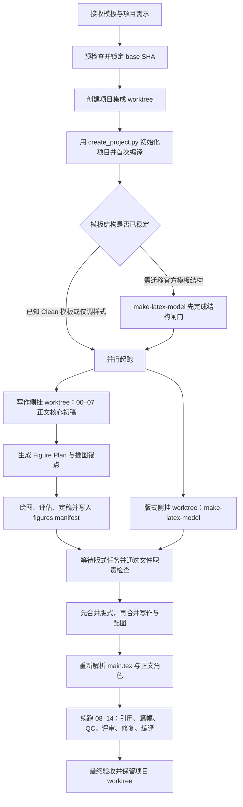

# NSFC 项目 Worktree 与写作、绘图、版式并行编排实施计划

## 通俗解释：究竟发生了什么

- **一句话说明：** 现在“建项目、写标书、画图、调模板”是几段独立操作；如果直接让它们同时在同一目录工作，容易互相覆盖，因此需要一个总调度台先分配独立工作区，再把结果有序汇总。
- **生活类比：** 这像装修一套房子：文案组负责“房间里放什么”，设计组负责“墙面和尺寸怎么调”，绘图组根据文案组确定的内容制作挂画。三组可以同时开工，但不能同时在同一面墙上施工，最后还需要项目经理统一验收。
- **对应到本问题：** 项目经理是新的编排器；每个 Git worktree 是一套相互隔离的施工现场；`nsfc-full-pipeline` 是写作组；绘图技能是配图组；`make-latex-model` 是模板与版式组；最终集成 worktree 是交付现场。
- **改变前后：** 现在需要人工复制模板、切目录、依次下达多条指令并处理冲突；改进后只需给出模板、项目名和需求文件，系统就能创建项目 worktree、并行启动写作与版式任务、在正文初稿后自动衔接绘图，并在同一项目分支完成最终编译和验收。

## 专业判断：问题在哪里

- **现有能力已经具备，但没有上层编排：** `scripts/create_project.py` 能从 `NSFC_General_Clean` 或 `NSFC_Local_Clean` 创建项目；`nsfc-full-pipeline` 已有 00–14 阶段断点；`auto-draw-plot` 有独立出图工作区和多轮迭代；`make-latex-model` 能按产品线调整模板并用官方入口验收。缺的是把四者安全串并联的控制层。
- **单个工作目录不适合真正并行：** 写作会修改正文、参考文献和过程文档；版式建模可能修改 `main.tex`、`extraTex/@config.tex`、项目 wrapper 或公共包。即使多数文件不同，构建缓存、结构映射和 Git 暂存区仍可能互相干扰。
- **绘图不能等到所有检查结束后才开始：** 图片会改变页数、浮动位置和论证连贯性。如果在篇幅对齐、QC 和最终编译之后才插图，就必须重复大量检查。更合理的时机是正文核心初稿完成之后、篇幅控制之前。
- **新版式可能改变正文落点：** `nsfc-full-pipeline` 以 `main.tex` 的真实 `\input` / `\include` 为正文映射依据。如果 `make-latex-model` 需要改章节结构，就不能让写作线程在旧映射上盲写。
- **当前主工作区可能有未提交文件：** 新项目必须基于一个明确的 Git commit 创建，不能悄悄把主工作区里的未提交内容带入或丢弃。编排器需要记录 `base_sha`，并明确说明未提交修改不会进入新 worktree。

## 要达到什么目标

- 用户提供模板、项目名、申报类型和项目需求后，用一个入口完成初始化。
- 对用户只暴露一个长期保留的“项目集成 worktree”；内部为并行任务创建两个临时侧挂 worktree，避免互相踩文件。
- 写作主线与版式主线尽早并行；正文核心初稿完成后立即触发绘图，绘图完成后再进行篇幅、QC、评审和最终编译。
- 任一任务中断后可以 `resume`，不重建项目、不重跑已验证阶段，也不自动删除现场。
- 最终结果必须在集成 worktree 中通过官方 NSFC 构建、正文就绪度检查、配图完整性检查，以及按需执行的模板基线对比。

本次不包括：自动推送远程分支、自动创建 PR、自动删除 worktree、扩展到 `GDNSF_*` / `GXNSF_*`，以及改变各现有 Skill 的核心职责。

## 推荐的总体编排



这里的“并行”有一个必要例外：若用户给的是尚未落地的新官方模板，且 `make-latex-model` 必须改变 `main.tex` 或正文文件结构，应先完成最小的 `structure_ready` 闸门；结构稳定后，像素级和样式级调优再与写作并行。对现成的 `NSFC_General_Clean`、`NSFC_Local_Clean` 或其结构兼容模板，可以在首次编译通过后立即并行。

## 改进方向

### 建立一个薄的项目编排层

新增项目级编排 Skill，例如 `nsfc-project-orchestrator`，并配套一个只负责确定性操作的 Python 入口。Skill 负责理解用户意图、选择和调用下游技能；脚本负责校验路径、创建分支/worktree、保存状态、检查文件职责和执行合并。

这符合当前仓库“确定性操作交给脚本、语义判断交给 AI”的约定，也避免把 Git 操作塞进 `nsfc-full-pipeline` 或 `make-latex-model`。

建议提供四个动作：

- `start`：创建项目、初始化状态并启动两条任务线；
- `status`：查看 worktree、分支、阶段、阻塞原因和下一步；
- `resume`：从最近安全断点继续；
- `cleanup`：在用户明确要求后移除已合并的临时 worktree，默认不执行。

### 固定用户输入契约

启动时至少需要以下信息：

| 输入 | 作用 | 默认或规则 |
|---|---|---|
| 项目名 | 决定项目目录、分支和 worktree 名称 | 必须符合 `NSFC_[A-Za-z0-9_-]+` |
| 项目模板 | 决定三段式或五段式骨架 | 优先 `NSFC_General_Clean` / `NSFC_Local_Clean` |
| 项目需求文件 | 确定选题、研究边界、申报约束和配图要求 | Markdown 或 YAML；记录来源和 SHA-256 |
| 申报类型与篇幅 | 初始化断点中的 `type`、`grant_type`、`length_budget` | 无法从模板与需求确定时一次性询问 |
| 申请人事实文件 | 供 draft-first 写作读取真实履历与成果 | 可使用仓库内相对路径或明确的外部绝对路径 |
| 版式基线 | 决定 `make-latex-model` 是按仓库标准还是按官方 PDF 对齐 | 可选；提供时记录文件哈希 |
| 配图策略 | 决定需画哪些图、是否为必交付项 | 默认由需求与研究方案生成 Figure Plan，不写死固定图数 |

项目需求应收敛到现有的项目事实来源，不另建一份与 `docs/00_项目事实库.md` 竞争的事实清单。编排状态只记录路径、哈希和任务状态，不复制研究事实。

一个可实现的用户入口可以是：

```bash
python3 scripts/nsfc_project_orchestrator.py start \
  --template NSFC_General_Clean \
  --name NSFC_2027_Example \
  --requirements /abs/path/project-requirements.md \
  --applicant-profile docs/applicants/yan-feng.md \
  --baseline /abs/path/official-template.pdf
```

如果用户不提供 baseline，版式任务按当前仓库模板标准验收；如果提供，则额外进行 PDF 参数分析和必要的视觉/像素比对。

### 使用“一个项目现场 + 两个临时施工区”

建议沿用仓库现有的 sibling worktree 目录习惯：

```text
ChineseResearchLaTeX.worktrees/
├── NSFC_2027_Example/          # 用户长期使用的集成 worktree
├── NSFC_2027_Example-writing/  # 临时：写作 + 配图
└── NSFC_2027_Example-layout/   # 临时：模板 + 版式
```

对应分支建议为：

```text
proposal/NSFC_2027_Example/integration
proposal/NSFC_2027_Example/writing
proposal/NSFC_2027_Example/layout
```

启动顺序为：解析并记录 `base_sha` → 创建 integration 分支/worktree → 在 integration 中调用现有 `scripts/create_project.py` → 初始化事实接线和断点 → 首次官方编译 → 提交一笔仅包含项目骨架的 bootstrap commit → 从该 commit 派生 writing 和 layout 两个 worktree。

这样用户仍然只需要进入 integration worktree 查看最终结果，而两个并行任务拥有各自独立的工作目录、Git 索引和构建缓存。

### 用文件职责白名单消除静默冲突

每条任务线结束时，编排器先检查相对 bootstrap commit 的文件清单；超出职责范围就停止合并并报告，不自动猜测如何解决。

| 任务线 | 允许写入 | 明确禁止 |
|---|---|---|
| 写作 | 当前项目的正文 `extraTex/*.tex`、`references/`、`docs/`、`review/` | `extraTex/@config.tex`、公共样式、字体包 |
| 配图 | 当前项目的 `figures/`、Figure Plan、图稿清单，以及在写作拥有的正文中插入图环境 | 修改模板结构、公共包、申请人事实 |
| 版式 | `main.tex`、`extraTex/@config.tex`、项目 wrapper、必要的 profile/style/package 与验收报告 | 改写正文语义、参考文献和研究事实 |
| 编排器 | worktree/分支、控制状态、合并记录 | 代替下游技能生成正文或视觉内容 |

`make-latex-model` 若判断必须修改 `packages/bensz-*`，仍需先运行公共包回归规划，并回归该包覆盖的全部项目。该任务不能因为位于某个标书 worktree 中就跳过仓库级回归。

### 把绘图放在正文初稿之后、篇幅检查之前

不修改 `nsfc-full-pipeline` 现有 00–14 编号，新增一个由上层编排器管理的侧挂闸门 `figures_after_draft`：

1. 写作任务先运行 00–07，形成研究主题、科学问题、研究方案和正文核心初稿。
2. 依据 `docs/04_研究方案与技术路线.md`、正文和项目需求生成结构化 Figure Plan；每张图至少明确 `figure_id`、用途、信息节点、caption、正文插入锚点、模式和验收要求。
3. 调用现有绘图工作流。技术路线图用 `roadmap`，机制/架构图用 `schematic`；`auto-draw-plot` 通过 BenszAPI 负责 prompt、出图、评估和多轮修改，其隐藏中间文件继续留在 `.bensz-api/`。
4. 通过验收的图片复制到项目正式 `figures/`，写入 `figures/manifest.yaml`，记录来源、哈希、caption、label、插入位置和状态；正文只引用 manifest 中的正式文件，不引用隐藏工作区。
5. 在正文中插入图、caption 和交叉引用，然后再续跑 08–14。这样引用检查、篇幅对齐、QC、模拟评审和最终编译看到的是含图完整稿。

如果配图任务失败，写作可以继续完成当前草稿，但最终状态应为 `figures_after_draft: failed` 或 `need_user_input`，不能把含图交付要求标成完成。图片 provider 的密钥、请求正文和内部错误不得进入 Git 或项目 manifest。

### 设置结构闸门与有序合并

并行启动前，编排器判断版式任务属于哪一类：

- **样式调优：** 不改变正文文件映射，可与写作立即并行。
- **结构迁移：** 会新增、删除、重命名正文文件或改变 `main.tex` 输入链；先由版式任务产出 `structure_ready` commit，写作分支再从该 commit 创建。之后的字体、间距、标题和像素级调优仍可并行。

最终合并固定为：版式分支先进入 integration，写作/配图分支后进入。合并后必须运行 `pipeline_state.py migrate → reconcile → next`；若 `main.tex` 指纹变化，现有机制会自动让 stage 00 重新解析正文角色，禁止手工沿用旧映射。

任何超出白名单的重叠修改都进入人工决策，不使用 `ours` / `theirs` 全局覆盖。尤其不能为了消除冲突而丢弃正文、`@config.tex` 或公共包的一整侧改动。

### 建立独立于三个 Skill 的可恢复状态

编排器状态由 integration 任务独占，两个 worker 只回报结果，不直接并发写同一状态文件。状态至少记录：

- schema 版本、项目名、模板、`base_sha` 和 bootstrap commit；
- 三个 worktree 的绝对路径、分支和当前 HEAD；
- `structure_ready`、`writing_core_ready`、`figures_ready`、`layout_ready`、`merged`、`final_ready` 六个闸门；
- 每条任务线的状态、开始/结束时间、产物哈希、失败原因和可重试入口；
- 最后成功合并的 commit，以及是否允许清理临时 worktree。

正文阶段状态仍由 `docs/workflow_status.yaml` 维护；绘图运行细节仍由 `.bensz-api/.../meta/result.json` 维护；模板对齐仍用 `.make_latex_model/` 和官方报告。上层状态只引用这些来源，不复制它们的内部字段。

`resume` 先校验 worktree 路径、分支 HEAD 和产物哈希，再决定继续当前任务、重新派生 worker，还是停下报告人为改动。它不得覆盖 worker 中尚未提交的修改。

## 实施范围与顺序

1. 先实现 worktree/分支预检查、项目 bootstrap、状态文件和 `start/status/resume/cleanup` 的确定性脚本，并复用现有 `create_project.py`，不再写第二套模板复制逻辑。
2. 再新增上层编排 Skill，固定两条并行任务的输入、职责白名单、完成回报和结构闸门。
3. 为 `nsfc-full-pipeline` 增加由上层调用时“在 stage 07 后交还控制权、随后从 stage 08 续跑”的调用约定；不改变现有 00–14 的 ID 和旧项目断点兼容性。
4. 接入 Figure Plan、正式图片 manifest 与正文插入规则，使绘图产物进入项目而中间文件保持隔离。
5. 接入 `make-latex-model` 的 `structure_ready` / `layout_ready` 回报和公共包回归门禁。
6. 最后完成有序合并、重新对账、08–14 续跑、官方构建与整体验收，并同步项目级 Skill 文档、根级/Skill 级 CHANGELOG 和用户指南。

## 如何确认完成

- 给出一个已知 Clean 模板和需求文件后，能自动创建 integration、writing、layout 三个 worktree；主工作区的未提交文件不被带入、不被修改。
- integration 中的新项目由现有 `create_project.py` 产生，带正确的 VS Code 配置、事实接线和 schema v2 写作断点，并能首次编译。
- 样式型任务中，写作与版式确实可同时运行；结构型任务中，写作只在 `structure_ready` 后启动。
- writing/layout 分支若写入越权文件，合并前能确定性拦截；合法改动无静默覆盖。
- stage 07 后能够生成 Figure Plan，正式图片只从 `figures/manifest.yaml` 进入正文，`.bensz-api/` 不被正文引用。
- 两条任务无论谁先完成，都能在 integration 中按固定顺序合并；中断后 `resume` 不重建已完成工作。
- 合并后若 `main.tex` 改变，stage 00 会被重新解析；随后含图稿完成 08–14，官方构建零错误。
- 最终报告同时给出模板对齐结果、配图状态、15 个正文阶段、剩余硬事实、`body_pipeline_ready` 与 `submission_ready`，不把“正文完成”误报成“申请书可提交”。
- 公共包未修改时只验目标项目；公共包修改时，回归计划列出的所有受影响模板均通过，warning 明确区分既有与新增。
- 未显式执行 `cleanup` 时，失败或未合并的 worktree 均保留；清理前再次校验分支已合并且工作区无未提交修改。

建议至少覆盖以下自动化场景：正常并行、目标路径/分支重名、主工作区 dirty、首次编译失败、结构闸门、worker 越权修改、绘图失败、任一 worker 先完成、合并冲突、中断续跑、公共包回归和安全清理。所有测试产物放在 `tests/` 子目录，不污染仓库根目录。

## 风险与待确认事项

- **推荐默认采用三 worktree 模型。** 如果强制只使用一个物理 worktree，就只能把两个技能改为串行或引入脆弱的文件锁，无法同时隔离 Git 索引、构建缓存和未提交修改。
- **需要确定编排运行载体。** 在 Codex 中可由上层 Skill 启动两个隔离 agent；在纯命令行环境中可由两个 `codex exec`/等价宿主进程运行。Git 与状态协议不应依赖某一个宿主实现。
- **需要明确配图交付标准。** 若项目要求中文文字绝对正确或可编辑图稿，应在 Figure Plan 中把人工修字/PPT 矢量化列为必过门禁；仅接受生成式 JPEG 时可以省略该环节。
- **敏感输入不能被默认提交。** 外部申请人材料、密钥和未脱敏附件应只记录引用路径与哈希；是否复制到项目或纳入 Git 必须由用户明确决定。
- **不自动推送。** integration 分支完成后是否推到 `origin`、是否创建 PR，属于单独授权动作。
