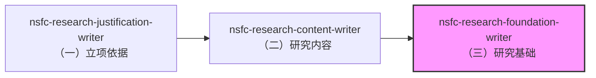

# nsfc-research-foundation-writer

用于 NSFC 标书正文 `（三）研究基础` 的写作/重构，并**同时编排**：

- `3.2 工作条件`
- `3.1 中的研究风险应对`

目标是用"证据链"证明做得成，并把条件与风险对位到研究内容。

## 技能依赖关系

本技能属于 NSFC 申请书写作流程的一部分，建议按以下顺序使用：



**推荐顺序**：
1. **先写（一）立项依据**：使用 `nsfc-research-justification-writer`
2. **再写（二）研究内容**：使用 `nsfc-research-content-writer`
3. **最后写（三）研究基础**：使用本技能

**原因**：
- `3.2 工作条件` 需要与 `2.1` 研究内容的关键任务对齐
- 风险应对需要与 `2.3` 年度研究计划兼容
- 研究基础需要证明"有能力完成研究内容"

**如果必须跳过前置步骤**：
- 请手动提供 `2.1` 和 `2.3` 的内容，以便 AI 进行一致性校验
- 或者在完成 `2.1` 和 `2.3` 后，重新使用本技能进行校验和调整

## 快速开始

### 1. 准备项目
确保你的 NSFC 项目在 `projects/NSFC_Young`（或其他路径）

### 2. 准备信息表
按照 [references/info_form.md](references/info_form.md) 准备以下信息：
- 前期基础（证据链素材）
- 团队与分工
- 条件与资源
- 风险清单（至少 3 条）

### 3. 执行技能
```
请使用 nsfc-research-foundation-writer：
目标项目：projects/NSFC_Young
信息表：<按 references/info_form.md 提供>
输出：落点从 main.tex 按角色解析（勿按 extraTex/3.*.tex 编号 glob 选文件）
额外要求：风险应对至少 3 条，每条要有早期信号与备选方案
output_mode：apply（默认）/ preview（只预览不写入）
```

## 输出文件

- `foundation` 角色：研究基础 + 风险应对（三段式 `3.1.研究基础.tex`；五段式 `2.1.研究基础.tex`）
- `work_conditions` 角色：工作条件（三段式 `3.2.工作条件.tex`；五段式 `2.2.工作条件.tex`）

## 输出示例

见 [references/example_output.md](references/example_output.md)

## 注意事项

- 本技能只修改落点解析得出的两个角色文件，不会修改 `main.tex` 或模板文件；也不会写入承担项目 / 完成国基项目 / 项目完成情况
- 风险应对至少需要 3 条（技术/进度/资源各至少 1 条）
- 工作条件必须与「研究内容」的关键任务对齐（该章在三段式为 `2.1.研究内容`、五段式为 `1.2.内容目标问题`，同样按角色定位）

## 写入落点：按角色解析（不按编号）

NSFC 模板不共用一套章节编号，而且编号互相重叠：

| 布局 | 项目 | 研究基础 | 工作条件 |
|---|---|---|---|
| 三段式 | `NSFC_General`、`NSFC_General_Clean`、`NSFC_Young` | `3.1.研究基础` | `3.2.工作条件` |
| 五段式 | `NSFC_Local`、`NSFC_Local_Clean` | `2.1.研究基础` | `2.2.工作条件` |

在五段式项目上，`extraTex/3.*.tex` 匹配到的其实是 `3.1.不同类型国基情况` / `3.2.同年单位不一致`——属于「其他说明」里的声明章节。按编号写会把研究基础写进声明章节**且编译不报错**。所以本技能强制先读 `main.tex` 里未被注释的 `\input{extraTex/...}`，按角色关键词归类出真实文件，解析不出就停下来问你。

## 可选自检（只读）

- 仅校验 skill 自身一致性：`python3 skills/nsfc-research-foundation-writer/scripts/validate_skill.py`
- 同时检查某个项目的输出文件：`python3 skills/nsfc-research-foundation-writer/scripts/run_checks.py --project-root projects/NSFC_Young`
